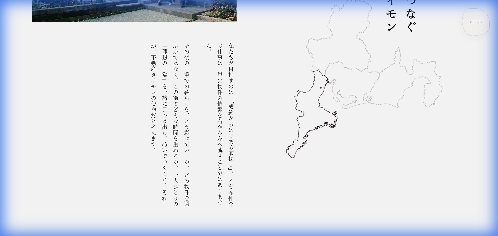

# Walkthrough - Concept Section Layout Rescue

## Overview
Based on the urgent request to fix the broken layout, I have completely rewritten the CSS and structure for `ConceptSection.svelte`. The focus was on strictly adhering to the "2-column 50/50" rule and properly implementing vertical text without layout constraints.

## Changes

### `src/components/ConceptSection.svelte`
- **Reset & Rewrite**: Removed all previous complex styles.
- **Layout**: Implemented a strict 2-column flex layout (`50%` width each) with a `5vw` gap.
- **Typography**: 
    - Applied `writing-mode: vertical-rl` to the text.
    - Set `height: 480px` layout flow to ensuring text spans multiple vertical lines correctly.
    - Added `letter-spacing: 0.1em` and `line-height: 2.2` for the Japanese aesthetic.
    - **[UPDATE] Fixed Line Breaks**: Replaced text with the exact user-provided content using ` ` tags to enforce specific line breaks and spacing, avoiding reliance on auto-wrapping.
- **Animation**: Added a slide-in animation (`opacity` and `transform: translateX`) for the top-left image, triggered by `IntersectionObserver`.

## Verification Results

### Browser Verification
- **Layout**: Confirmed 50/50 split between image/text column and map column.
- **Text**: Confirmed vertical orientation (`vertical-rl`) with manual line breaks properly rendered.
- **Animation**: Validated correct transition properties on the image.

